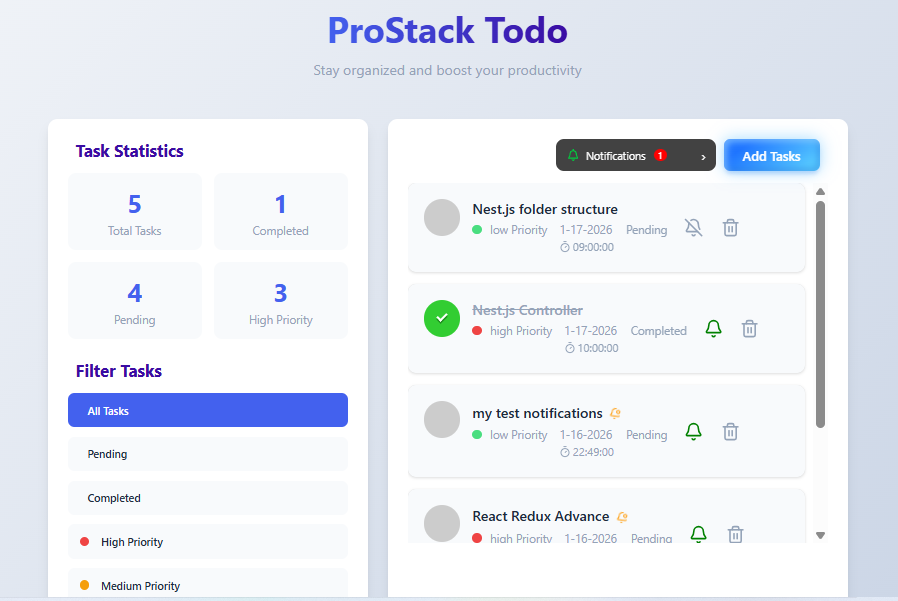

# 📝 Todo App - Modern Task Management


A sleek, modern todo application built with React and Vite, designed to help you manage your daily tasks efficiently with a clean and intuitive interface.

## 🎬 Live Demo Preview

[](https://prostackcreations-todo.vercel.app)

## ✨ Features

### 🎯 **Core Functionality**
- ✅ **Add, edit, and delete tasks** with ease
- 📱 **Fully responsive** design for mobile and desktop
- 🎨 **Clean, modern UI** with intuitive controls
- ⚡ **Blazing fast performance** powered by Vite
- 🔄 **Real-time updates** without page reloads

### 📊 **Task Management**
- Mark tasks as complete/incomplete
- Organized task display
- Persistent task storage
- Efficient task filtering

## 🚀 Quick Start

### Prerequisites
- Node.js (v16 or higher)
- npm or yarn package manager

### Installation
```bash
# Clone the repository
git clone https://github.com/AmjadKhan88/Todo.git

# Navigate to project directory
cd Todo

# Install dependencies
npm install

# Start the development server
npm run dev

Todo/
├── src/
│   ├── components/     # React components
│   ├── styles/        # CSS/SCSS files
│   ├── App.jsx        # Main application component
│   └── main.jsx       # Application entry point
├── public/            # Static assets
├── index.html         # HTML template
└── package.json       # Dependencies and scripts

🛠️ Tech Stack
    Frontend Framework: React 18+

    Build Tool: Vite

    Styling: CSS3

    Package Manager: npm

    Deployment: Vercel

📱 Live Demo
    Visit the live application at: https://prostackcreations-todo.vercel.app

🤝 Contributing
    Contributions are welcome! Here's how you can help:

    Fork the repository

    Create a feature branch (git checkout -b feature/AmazingFeature)

    Commit your changes (git commit -m 'Add some AmazingFeature')

    Push to the branch (git push origin feature/AmazingFeature)

    Open a Pull Request

👤 Author
     Amjad Khan
     GitHub: @AmjadKhan88

Project Link: https://github.com/AmjadKhan88/Todo

🌟 Show Your Support
   Give a ⭐️ if you like this project!
